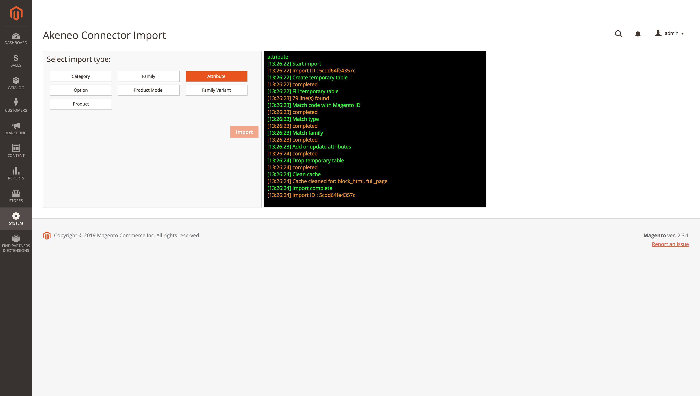

# Akeneo connector interface:

### Locate and use the interface:

Akeneo connector Import Interface is located at System > Akeneo connector > Import:

Select your import type from the list and click “Import” to launch the job:
* Once you launch your import, you can follow the import progress with the console.
>  DO NOT CLOSE THE BROWSER WINDOW WHILE THE IMPORT IS STILL ON!
* If an error appears, you can easily identify which task the problem affected. You can also check your logs files if you want further information.

##### [> Back to summary](../summary.md)
